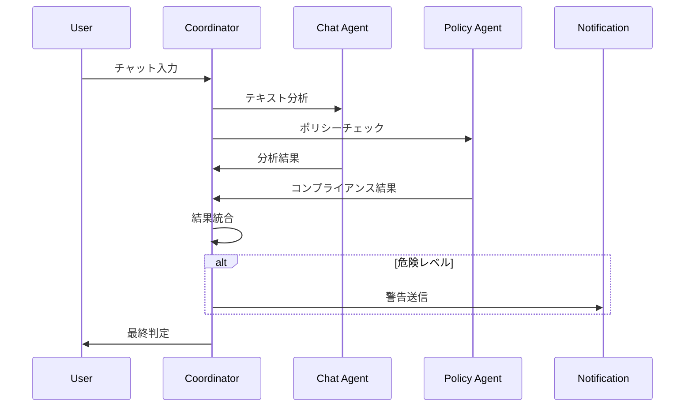
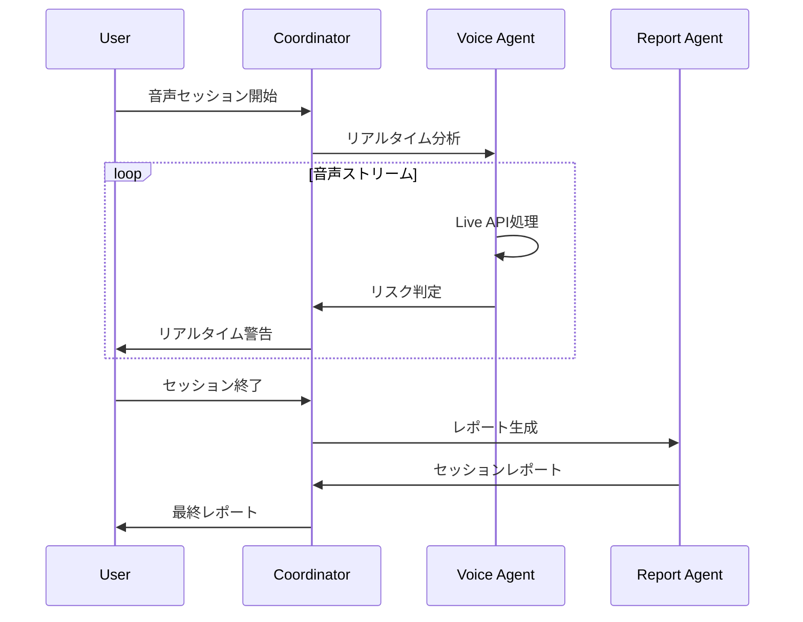

# チョットマッタ Agent設計書

## 🎯 Agent概要

チョットマッタ Agentを機能要件に基づいて整理し、各Agentの責務と連携方法を定義します。

## 🏗️ Agent全体アーキテクチャ

```
[Frontend]
    ↓ WebSocket/API
[Agent Coordinator] ← メインコーディネーター
    ├── [Chat Analysis Agent] ← チャット監視
    ├── [Voice Analysis Agent] ← 音声監視  
    ├── [Policy Manager Agent] ← ポリシー管理
    ├── [Report Generator Agent] ← レポート生成
    ├── [Notification Agent] ← 通知・アラート
    └── [Analytics Agent] ← 分析・統計
```

## 🤖 必要Agent種類一覧

### 1. **Agent Coordinator** (メインコーディネーター)
**役割**: 全Agentの統括・ルーティング・セッション管理
**技術**: ADK Runner + Session Management
**重要度**: ⭐⭐⭐⭐⭐ (最重要)

### 2. **Chat Analysis Agent** (チャット分析)
**役割**: リアルタイムテキスト分析・リスク検知・改善提案
**技術**: ADK + Vertex AI Gemini API
**重要度**: ⭐⭐⭐⭐⭐ (最重要)

### 3. **Voice Analysis Agent** (音声分析)
**役割**: Live API音声処理・感情分析・発言パターン分析
**技術**: Live API + ADK + Vertex AI Gemini API
**重要度**: ⭐⭐⭐⭐⭐ (最重要)

### 4. **Policy Manager Agent** (ポリシー管理)
**役割**: 企業ポリシー参照・コンプライアンス判定・ルール適用
**技術**: ADK + Firestore + カスタムツール
**重要度**: ⭐⭐⭐⭐ (重要)

### 5. **Report Generator Agent** (レポート生成)
**役割**: 分析レポート作成・統計処理・可視化データ生成
**技術**: ADK + Vertex AI Gemini API
**重要度**: ⭐⭐⭐ (標準)

### 6. **Notification Agent** (通知・アラート)
**役割**: リアルタイム警告・段階的エスカレーション・通知配信
**技術**: ADK + Cloud Functions + WebSocket
**重要度**: ⭐⭐⭐⭐ (重要)

### 7. **Analytics Agent** (分析・統計)
**役割**: 組織健全性分析・トレンド分析・改善提案
**技術**: ADK + Vertex AI + BigQuery
**重要度**: ⭐⭐ (オプション)

## 📋 Agent詳細仕様

### 1. Agent Coordinator (コーディネーター)

```python
class AgentCoordinator:
    """メインコーディネーター - 全Agentの統括"""
    
    def __init__(self):
        self.session_service = InMemorySessionService()
        self.agents = {
            'chat_analysis': ChatAnalysisAgent(),
            'voice_analysis': VoiceAnalysisAgent(),
            'policy_manager': PolicyManagerAgent(),
            'report_generator': ReportGeneratorAgent(),
            'notification': NotificationAgent(),
            'analytics': AnalyticsAgent()
        }
        
        self.root_agent = LlmAgent(
            model="gemini-2.0-flash-exp",
            name="coordinator",
            instruction=self._get_coordinator_instruction(),
            tools=self._get_coordinator_tools()
        )
    
    def _get_coordinator_instruction(self) -> str:
        return """
        あなたはSafeCommシステムのメインコーディネーターです。
        
        【役割】
        1. 入力タイプ（チャット/音声）の判定
        2. 適切なAgentへのルーティング
        3. 複数Agent結果の統合
        4. 最終レスポンスの生成
        
        【処理フロー】
        1. 入力分析 → Agent選択
        2. 並列処理実行
        3. 結果統合・優先度判定
        4. 統一レスポンス生成
        """
    
    async def route_request(self, request_type: str, data: dict) -> dict:
        """リクエストを適切なAgentにルーティング"""
        
        if request_type == "chat_analysis":
            # チャット分析フロー
            tasks = [
                self.agents['chat_analysis'].analyze(data),
                self.agents['policy_manager'].check_compliance(data),
            ]
            results = await asyncio.gather(*tasks)
            
            # 通知が必要な場合
            if results[0]['risk_level'] == 'danger':
                await self.agents['notification'].send_alert(results[0])
            
            return self._merge_results(results)
            
        elif request_type == "voice_analysis":
            # 音声分析フロー
            voice_result = await self.agents['voice_analysis'].analyze(data)
            
            if voice_result['risk_level'] != 'safe':
                policy_result = await self.agents['policy_manager'].check_compliance(data)
                return self._merge_results([voice_result, policy_result])
            
            return voice_result
            
        elif request_type == "generate_report":
            # レポート生成フロー
            return await self.agents['report_generator'].generate(data)
```

### 2. Chat Analysis Agent (チャット分析)

```python
class ChatAnalysisAgent:
    """チャット分析専門Agent"""
    
    def __init__(self):
        self.agent = LlmAgent(
            model="gemini-2.0-flash-exp",
            name="chat_analyzer",
            instruction=self._get_chat_instruction(),
            tools=[
                HarassmentDetectorTool(),
                ConfidentialityCheckerTool(),
                ToxicityAnalyzerTool(),
                SuggestionGeneratorTool()
            ]
        )
    
    def _get_chat_instruction(self) -> str:
        return """
        あなたはチャットメッセージの分析専門家です。
        
        【分析観点】
        1. モラハラ・パワハラ表現検知
        2. 社外機密情報の漏洩リスク
        3. 不適切な言い回し判定
        4. 建設的な代替表現提案
        
        【出力形式】
        {
          "risk_level": "safe|warning|danger",
          "confidence": 0.0-1.0,
          "detected_issues": ["issue1", "issue2"],
          "suggestions": ["suggestion1", "suggestion2"],
          "flagged_content": ["content1", "content2"]
        }
        
        【判定基準】
        - safe: 問題なし
        - warning: 注意が必要、改善提案あり
        - danger: 送信ブロック推奨、重大な問題
        """
    
    async def analyze(self, data: dict) -> dict:
        """チャットメッセージ分析"""
        message = data['message']
        context = data.get('context', {})
        
        # ADKでの分析実行
        analysis_prompt = f"""
        【分析対象】
        メッセージ: {message}
        部署: {context.get('department', 'unknown')}
        役職: {context.get('role', 'unknown')}
        
        上記メッセージを分析してください。
        """
        
        result = await self.agent.run(analysis_prompt)
        return self._parse_analysis_result(result)
    
    def _parse_analysis_result(self, result) -> dict:
        """分析結果をパース"""
        # JSONパース + エラーハンドリング
        pass
```

### 3. Voice Analysis Agent (音声分析)

```python
class VoiceAnalysisAgent:
    """音声分析専門Agent"""
    
    def __init__(self):
        self.live_api_client = LiveAPIClient()
        self.agent = LlmAgent(
            model="gemini-2.0-flash-exp",
            name="voice_analyzer",
            instruction=self._get_voice_instruction(),
            tools=[
                EmotionAnalyzerTool(),
                SpeechPatternTool(),
                ConversationBalanceTool(),
                VoiceHarassmentDetectorTool()
            ]
        )
    
    def _get_voice_instruction(self) -> str:
        return """
        あなたは音声コミュニケーション分析の専門家です。
        
        【分析観点】
        1. 感情分析（怒り・威圧・不安）
        2. 発言パターン（一方的・割り込み）
        3. 会話バランス（発言時間比率）
        4. ハラスメント発言検知
        
        【リアルタイム処理】
        - Live APIからの音声ストリーム処理
        - 300ms以内のレスポンス
        - 段階的警告レベル
        
        【出力形式】
        {
          "risk_level": "safe|warning|danger",
          "emotions": {"anger": 0.1, "intimidation": 0.3},
          "speech_pattern": "balanced|one_sided|interrupted",
          "conversation_balance": {"speaker_a": 0.6, "speaker_b": 0.4},
          "recommendations": ["recommendation1"]
        }
        """
    
    async def analyze_realtime(self, audio_stream) -> dict:
        """リアルタイム音声分析"""
        # Live API経由での音声処理
        transcription = await self.live_api_client.transcribe(audio_stream)
        
        # Gemini APIでの感情・パターン分析
        analysis = await self.agent.run(transcription)
        
        return self._parse_voice_result(analysis)
    
    async def generate_session_report(self, session_data: dict) -> dict:
        """セッション全体の分析レポート"""
        report_prompt = f"""
        【1on1セッション分析】
        参加者: {session_data['participants']}
        時間: {session_data['duration']}
        発言データ: {session_data['speech_data']}
        
        包括的な分析レポートを生成してください。
        """
        
        report = await self.agent.run(report_prompt)
        return self._parse_session_report(report)
```

### 4. Policy Manager Agent (ポリシー管理)

```python
class PolicyManagerAgent:
    """企業ポリシー管理Agent"""
    
    def __init__(self):
        self.firestore_client = firestore.Client()
        self.agent = LlmAgent(
            model="gemini-2.0-flash-exp",
            name="policy_manager",
            instruction=self._get_policy_instruction(),
            tools=[
                PolicyLookupTool(),
                ComplianceCheckerTool(),
                DepartmentRulesTool(),
                ViolationLoggerTool()
            ]
        )
    
    def _get_policy_instruction(self) -> str:
        return """
        あなたは企業コンプライアンス管理の専門家です。
        
        【管理対象】
        1. 部署別コンプライアンスルール
        2. 機密情報取り扱い規定
        3. ハラスメント防止ガイドライン
        4. 違反事例データベース
        
        【判定方式】
        - 部署・役職別のルール適用
        - 過去事例との照合
        - リスクレベルの段階判定
        - 改善アクション提案
        """
    
    async def check_compliance(self, data: dict) -> dict:
        """コンプライアンス適合性チェック"""
        content = data['content']
        user_context = data['context']
        
        # 部署別ポリシー取得
        policies = await self._get_department_policies(user_context['department'])
        
        # コンプライアンス判定
        compliance_prompt = f"""
        【対象コンテンツ】
        {content}
        
        【適用ポリシー】
        {policies}
        
        【ユーザー情報】
        部署: {user_context['department']}
        役職: {user_context['role']}
        
        コンプライアンス適合性を判定してください。
        """
        
        result = await self.agent.run(compliance_prompt)
        return self._parse_compliance_result(result)
    
    async def _get_department_policies(self, department: str) -> list:
        """部署別ポリシー取得"""
        policies_ref = self.firestore_client.collection('policies')
        query = policies_ref.where('department', '==', department)
        docs = query.stream()
        return [doc.to_dict() for doc in docs]
```

### 5. Notification Agent (通知・アラート)

```python
class NotificationAgent:
    """通知・アラート専門Agent"""
    
    def __init__(self):
        self.websocket_manager = WebSocketManager()
        self.agent = LlmAgent(
            model="gemini-2.0-flash-exp",
            name="notification_manager",
            instruction=self._get_notification_instruction(),
            tools=[
                AlertGeneratorTool(),
                EscalationTool(),
                NotificationChannelTool()
            ]
        )
    
    def _get_notification_instruction(self) -> str:
        return """
        あなたは通知・アラート管理の専門家です。
        
        【通知レベル】
        1. info: 情報通知（改善提案）
        2. warning: 警告（注意喚起）
        3. critical: 緊急（即座ブロック）
        
        【配信チャネル】
        - リアルタイム: WebSocket
        - 管理者通知: Email/Slack
        - エスカレーション: 上司・HR
        
        【メッセージ生成】
        - ユーザーフレンドリー
        - 具体的改善案付き
        - 段階的エスカレーション
        """
    
    async def send_realtime_alert(self, alert_data: dict) -> None:
        """リアルタイム警告送信"""
        notification = await self._generate_notification(alert_data)
        
        # WebSocketでリアルタイム送信
        await self.websocket_manager.send_to_user(
            user_id=alert_data['user_id'],
            message=notification
        )
    
    async def escalate_violation(self, violation_data: dict) -> None:
        """違反のエスカレーション"""
        escalation_prompt = f"""
        【違反内容】
        {violation_data}
        
        エスカレーション通知を生成してください。
        """
        
        escalation = await self.agent.run(escalation_prompt)
        
        # 管理者・HR部門への通知
        await self._notify_administrators(escalation)
```

### 6. Report Generator Agent (レポート生成)

```python
class ReportGeneratorAgent:
    """レポート生成専門Agent"""
    
    def __init__(self):
        self.agent = LlmAgent(
            model="gemini-2.0-flash-exp",
            name="report_generator",
            instruction=self._get_report_instruction(),
            tools=[
                DataAggregatorTool(),
                ChartGeneratorTool(),
                InsightAnalyzerTool(),
                RecommendationTool()
            ]
        )
    
    def _get_report_instruction(self) -> str:
        return """
        あなたは分析レポート生成の専門家です。
        
        【レポート種類】
        1. 1on1セッションレポート
        2. 部署別健全性レポート
        3. 組織全体統計レポート
        4. 改善提案レポート
        
        【生成内容】
        - データ可視化
        - トレンド分析
        - 改善提案
        - ベストプラクティス
        """
    
    async def generate_session_report(self, session_data: dict) -> dict:
        """1on1セッションレポート生成"""
        report_prompt = f"""
        【セッションデータ】
        {session_data}
        
        包括的な分析レポートを生成してください。
        - 会話バランス分析
        - 感情推移グラフ
        - 改善提案
        - コーチングヒント
        """
        
        report = await self.agent.run(report_prompt)
        return self._format_report(report)
```

## 🔄 Agent連携フロー

### チャット分析フロー


### 音声分析フロー


## 📊 Agent優先度・実装順序

### Phase 1 (必須・最重要)
1. **Agent Coordinator** - システム基盤
2. **Chat Analysis Agent** - チャット監視機能
3. **Policy Manager Agent** - コンプライアンス基盤

### Phase 2 (重要機能)
4. **Notification Agent** - リアルタイム警告
5. **Voice Analysis Agent** - 音声監視機能

### Phase 3 (拡張機能)
6. **Report Generator Agent** - レポート機能
7. **Analytics Agent** - 統計・分析機能

## 🛠️ 実装方針

### ハッカソン最適化
- **Phase 1のみ完全実装** → デモ可能な状態
- **Phase 2は基本機能** → 音声監視のコア部分
- **Phase 3はモック** → 管理画面でのダミーデータ表示

### 技術選択
- **ADK**: 全Agent共通基盤
- **Vertex AI Gemini API**: 高精度分析
- **Live API**: 音声処理専用
- **Firestore**: ポリシー・データ管理

この設計により、チョットマッタAIの全機能をカバーしつつ、ハッカソン期間での実装可能性を最大化できます。🚀
