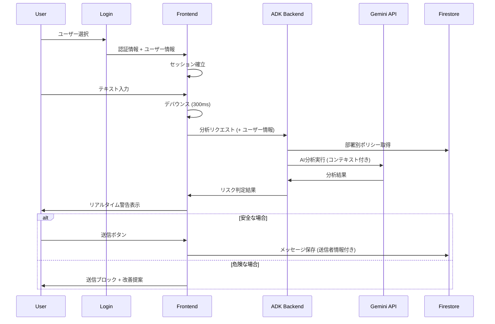

# チャットコミュニケーション機能 - 方式設計書

## 🎯 概要

チョットマッタAIのチャット機能は、リアルタイムでモラハラ・機密情報漏洩リスクを検知し、予防的介入を行う社内コミュニケーションシステムです。

## 🏗️ システム構成

### アーキテクチャ概要
```
[Web Browser (Next.js)]
    ↓ WebSocket/Server Actions
[Frontend Chat UI]
    ↓ Real-time Message Analysis
[ADK Backend (Cloud Run)]
    ↓ AI Analysis Request
[Vertex AI Gemini API]
    ↓ Document Reference
[Cloud Firestore (Company Policies)]
    ↓ Alert Generation
[Cloud Functions (Notifications)]
```

## 🔧 技術選定

### 1. チャット基盤
**選定技術**: **カスタムチャット実装** + **WebSocket (Socket.io)**

**理由**:
- 既存チャットツール（Slack/Teams）は外部API制限が厳しい
- リアルタイム分析には入力過程の監視が必要
- ADKとの統合の柔軟性
- ハッカソン期間での実装可能性

**代替案検討**:
- ❌ Slack API: リアルタイム入力監視不可
- ❌ Microsoft Teams API: 企業向けアクセス制限
- ❌ Discord Bot: ビジネス用途不適合

### 2. リアルタイム通信
**選定技術**: **Socket.io** + **Next.js Server Actions**

**技術詳細**:
```typescript
// フロントエンド: リアルタイム入力監視
const useRealtimeAnalysis = () => {
  const [inputText, setInputText] = useState('');
  const [analysisResult, setAnalysisResult] = useState(null);
  
  // デバウンス処理で300ms後に分析
  useEffect(() => {
    const timer = setTimeout(() => {
      if (inputText.length > 10) {
        analyzeMessage(inputText);
      }
    }, 300);
    return () => clearTimeout(timer);
  }, [inputText]);
};
```

### 3. AI分析エンジン
**選定技術**: **Google Cloud ADK** + **Vertex AI Gemini API**

**分析フロー**:
1. **入力監視**: 300ms間隔でテキスト分析
2. **ADKエージェント**: コンテキスト理解 + 企業ポリシー参照
3. **Gemini API**: 高精度な言語理解 + リスク判定
4. **レスポンス**: リスクレベル + 改善提案

```python
# ADKバックエンド: 分析エンジン
class ChatAnalysisAgent:
    def __init__(self):
        self.adk_client = ADKClient()
        self.gemini_client = VertexAIGeminiClient()
        self.policy_db = FirestoreClient()
    
    async def analyze_message(self, message: str, context: dict) -> AnalysisResult:
        # 1. 企業ポリシー取得
        policies = await self.policy_db.get_policies(context['department'])
        
        # 2. ADK + Gemini分析
        analysis = await self.adk_client.analyze_with_context(
            message=message,
            policies=policies,
            gemini_model="gemini-2.0-flash-exp"
        )
        
        # 3. リスク判定
        return AnalysisResult(
            risk_level=analysis.risk_level,
            suggestions=analysis.suggestions,
            confidence=analysis.confidence
        )
```

### 4. データストレージ
**選定技術**: **Cloud Firestore** + **Cloud Storage**

**データ設計**:
```typescript
// メッセージデータ構造
interface ChatMessage {
  id: string;
  content: string;
  sender_id: string;
  channel_id: string;
  timestamp: Timestamp;
  analysis_result: {
    risk_level: 'safe' | 'warning' | 'danger';
    confidence: number;
    suggestions: string[];
    flagged_content: string[];
  };
  is_sent: boolean; // false = 送信前ブロック
}

// 企業ポリシーデータ
interface CompanyPolicy {
  id: string;
  department: string;
  policy_type: 'harassment' | 'confidential' | 'general';
  rules: PolicyRule[];
  examples: {
    violation: string[];
    appropriate: string[];
  };
}
```

### 5. 認証・認可システム
**選定技術**: **NextAuth.js** + **モックユーザーDB**（ハッカソン最適化）

**ハッカソン向け実装方針**:
```typescript
// 簡易ユーザー管理（デモ用）
interface DemoUser {
  id: string;
  name: string;
  email: string;
  department: 'engineering' | 'sales' | 'hr' | 'management';
  role: 'member' | 'manager' | 'admin';
  avatar?: string;
}

// プリセットユーザー（デモ用）
const DEMO_USERS: DemoUser[] = [
  { id: '1', name: '田中マネージャー', email: 'tanaka@demo.com', department: 'engineering', role: 'manager' },
  { id: '2', name: '佐藤エンジニア', email: 'sato@demo.com', department: 'engineering', role: 'member' },
  { id: '3', name: '鈴木営業', email: 'suzuki@demo.com', department: 'sales', role: 'member' },
  { id: '4', name: 'HR山田', email: 'yamada@demo.com', department: 'hr', role: 'admin' }
];
```

**認証フロー**:
1. **ログイン画面**: プリセットユーザー選択方式
2. **セッション管理**: NextAuth.js + JWT
3. **権限制御**: 部署・役職ベースのポリシー適用

**実装優先度**: Phase 1（必須）

## 🚀 実装計画

### Phase 1: 基本チャット機能（7月1-5日）
1. **認証システム**
   - NextAuth.js セットアップ
   - プリセットユーザー管理
   - ログイン画面（ユーザー選択方式）

2. **Next.js チャットUI**
   - shadcn/ui ベースのチャットコンポーネント
   - リアルタイム入力監視
   - Socket.io クライアント実装

3. **ADKバックエンド基盤**
   - Cloud Run 環境構築
   - ADK初期設定
   - Firestore設定

### Phase 2: AI分析機能（7月6-10日）
1. **分析エンジン実装**
   - Vertex AI Gemini API統合
   - ADK エージェント開発
   - ポリシーデータベース構築

2. **リアルタイム分析**
   - WebSocket分析パイプライン
   - レスポンス最適化（300ms以内）

### Phase 3: 予防的介入機能（7月11-15日）
1. **警告システム**
   - 段階的警告UI
   - 送信ブロック機能
   - 改善提案表示

2. **学習機能**
   - ユーザーフィードバック収集
   - 分析精度向上

## 📊 パフォーマンス設計

### レスポンス時間目標
- **入力分析**: 300ms以内
- **メッセージ送信**: 100ms以内
- **チャット読み込み**: 500ms以内

### スケーラビリティ
- **同時接続**: 1000ユーザー
- **メッセージ処理**: 10,000件/分
- **ADK API呼び出し**: 100req/sec

### 最適化手法
1. **デバウンス処理**: 不要なAPI呼び出し削減
2. **キャッシュ戦略**: 企業ポリシーのメモリキャッシュ
3. **バッチ処理**: 類似メッセージのまとめて分析

## 🛡️ セキュリティ設計

### データ保護
1. **暗号化**: 全データ転送でTLS 1.3
2. **アクセス制御**: Firebase Auth + カスタムClaims
3. **監査ログ**: 全アクセス記録

### プライバシー配慮
1. **最小権限**: 必要最小限のデータアクセス
2. **データ保持**: メッセージ自動削除（30日）
3. **匿名化**: 統計データの個人情報除去

## 🔄 認証付きリアルタイム分析フロー



## 🎨 UI/UX設計

### 1. ログイン画面（ハッカソン最適化）
```typescript
// デモ用ログイン画面
const DemoLogin = () => {
  return (
    <div className="min-h-screen flex items-center justify-center">
      <Card className="w-96">
        <CardHeader>
          <CardTitle>チョットマッタ Demo</CardTitle>
          <CardDescription>ユーザーを選択してください</CardDescription>
        </CardHeader>
        <CardContent className="space-y-3">
          {DEMO_USERS.map(user => (
            <Button
              key={user.id}
              variant="outline"
              className="w-full justify-start"
              onClick={() => signIn(user)}
            >
              <Avatar className="mr-3">
                <AvatarFallback>{user.name[0]}</AvatarFallback>
              </Avatar>
              <div className="text-left">
                <div className="font-medium">{user.name}</div>
                <div className="text-sm text-muted-foreground">
                  {user.department} - {user.role}
                </div>
              </div>
            </Button>
          ))}
        </CardContent>
      </Card>
    </div>
  );
};
```

### 2. チャットインターフェース
### 2. チャットインターフェース
1. **ヘッダー**
   - ログインユーザー情報表示
   - 部署・役職バッジ
   - ログアウトボタン

2. **メッセージ入力エリア**
   - リアルタイム分析インジケーター
   - 警告レベル表示（緑/黄/赤）
   - 改善提案ポップアップ

3. **メッセージ表示エリア**
   - 送信済みメッセージの事後分析結果
   - 匿名化統計データ表示

4. **設定パネル**
   - 分析レベル調整
   - 通知設定
   - プライバシー設定

### shadcn/ui コンポーネント活用
```typescript
// チャット入力コンポーネント例
const ChatInput = () => {
  return (
    <div className="border rounded-lg p-4">
      <Textarea 
        placeholder="メッセージを入力..."
        onChange={handleInputChange}
        className="mb-2"
      />
      <div className="flex justify-between items-center">
        <Badge variant={getRiskVariant(riskLevel)}>
          {getRiskLabel(riskLevel)}
        </Badge>
        <Button 
          disabled={riskLevel === 'danger'}
          onClick={handleSend}
        >
          送信
        </Button>
      </div>
      {suggestions.length > 0 && (
        <Alert className="mt-2">
          <AlertDescription>
            {suggestions[0]}
          </AlertDescription>
        </Alert>
      )}
    </div>
  );
};
```

## 📋 テスト戦略

### demo/ディレクトリ構成
```
demo/
├── chat-test/
│   ├── harassment-scenarios.tsx  # モラハラ検知テスト
│   ├── confidential-scenarios.tsx # 機密情報検知テスト
│   └── realtime-analysis.tsx     # リアルタイム分析テスト
├── components/
│   └── test-message-generator.tsx # テストメッセージ生成
└── utils/
    └── test-scenarios.ts          # テストシナリオ定義
```

### テストシナリオ例
1. **モラハラ検知テスト**
   - 「いつも結果が出せないね」→ 危険レベル検知
   - 「一緒に改善していきましょう」→ 安全判定

2. **機密情報検知テスト**
   - 「売上データを○○社に」→ 機密情報警告
   - 「公開情報として」→ 安全判定

---

この方式設計により、ハッカソン期間内で実装可能かつ技術的にインパクトのあるチャットコミュニケーション機能を構築できます。ADK + Vertex AI Gemini APIの組み合わせにより、従来のチャットツールでは実現できない高精度なリアルタイム監視を提供します。
